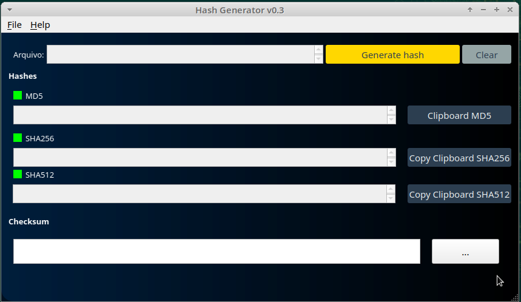

# HASHGEN 
A Simple tool to generate hashes. MD5, SHA1, SHA256

Tools Used: 
- Qtcreator

I created this tool because the existent tools was lame and most of them are  paid sharewares for a "free" tool offered by Microsoft, and i can's stand PowerShell Syntax.

Dependencies:
- Qt5+
- qmake

## TODO LIST:
- [x] Added Hash Tool for Windows 7 (Minimum)
- [ ] Fix Ugly Template
- [ ] Save a HashFile 
- [ ] Add a Shell Context a.k.a Mouse Right Button (Windows Only)
- [ ] Add Linux Support (generate Hashes)
- [ ] Add MacOS Support (i'm poor)
- [x] Add Copy Hash to Clipboard Button
- [ ] Add Program argv params

#### Release 1.0 only if finish all TODO list above

## Screenshots

